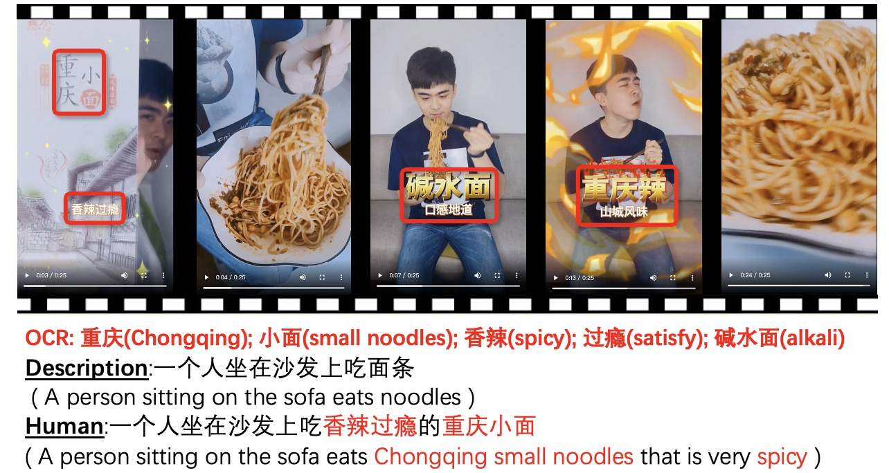
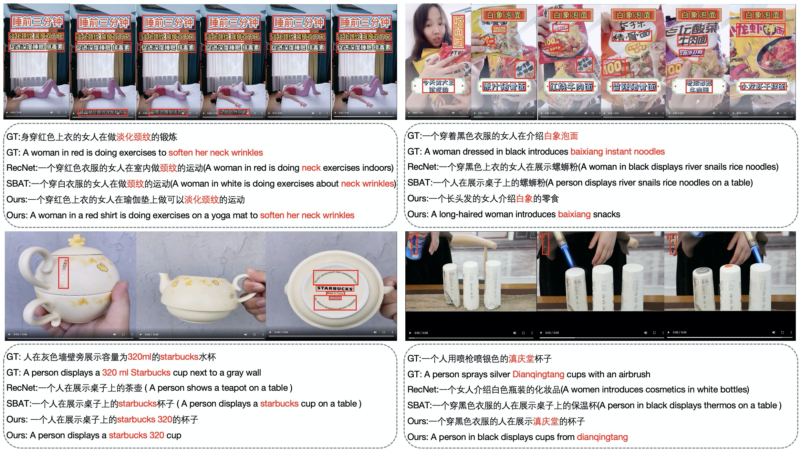

# STVD

This repository contains the reference code for the paper *Recognize-And-Tell: Generating Video Captions with Textual Cue in Scene*


## :bell: Todolist
• Open-source data :white_check_mark:  
• Open-source evaluation code :white_check_mark:  
• Open-source training code :white_check_mark:  
• Open-source model weights :white_check_mark:

## :file_folder: E-TVCaps Dataset
ST-Caps Dataset can be download [here](https://taocaption.oss-cn-hangzhou.aliyuncs.com/TaVD_data/Tao_caption.csv).

## :computer: Environment

### Requirements

- Ubuntu 18.04
- CUDA 11.4
- Nvidia Geforce GTX 3090

### :gear: Setup

Clone the repository and setup python environment

```
pip install --upgrade pip
pip install -r requirements.txt
```

## :floppy_disk: Prepare Data

To run the code,  features for the ST-Caps dataset are needed. Please download the features file and place it in the STVD_data folder.

- [ST-Caps_resnet152.hdf5](https://taocaption.oss-cn-hangzhou.aliyuncs.com/TaVD_data/Tao_resnet152.hdf5)
- [ST-Caps_region.hdf5](https://taocaption.oss-cn-hangzhou.aliyuncs.com/TaVD_data/Tao_region.hdf5)
- [ST-Caps_geometry.hdf5](https://taocaption.oss-cn-hangzhou.aliyuncs.com/TaVD_data/Tao_geometry.hdf5)
- [ST-Caps_semantic.hdf5](https://taocaption.oss-cn-hangzhou.aliyuncs.com/TaVD_data/Tao_semantic.hdf5)
- [ST-Caps_shot.hdf5](https://taocaption.oss-cn-hangzhou.aliyuncs.com/TaVD_data/Tao_shot.hdf5)
- [ST-Caps_ocr_vector_512.hdf5](https://taocaption.oss-cn-hangzhou.aliyuncs.com/TaVD_data/Tao_ocr_vector_512.hdf5)

## :fire: Training procedure

Run `python train.py --exp_name STVD --batch_size 32 --head 8 ` 

## :zap: Evaluation

To reproduce the results reported in our paper, download the pretrained model file [STVD.pth](https://taocaption.oss-cn-hangzhou.aliyuncs.com/TaVD_data/TaVD.pth) and place it in the STVD_data folder.

Run `python test.py` 

## :art: Visualization
The visualization of several examples on the ST-Caps dataset which involve captions generated by humans (GT), the comparison methods (RecNet and SBAT), and our STVD model. The red color words denote scene text mined from video. 

